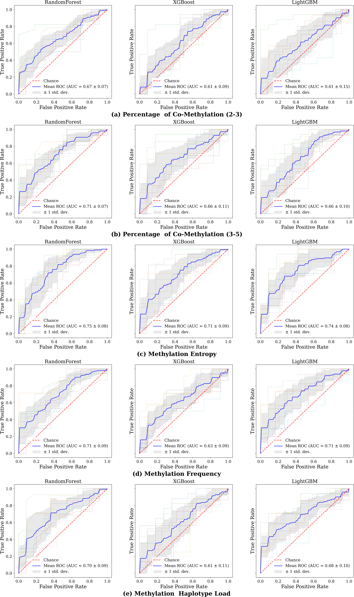

# Noninvasive Lung Cancer Early Detection via Deep Methylation\\ Representation Learning (Technical Appendix)

## Abstract
In this technical appendix, we first introduce the implementation details, including the baselines, the hyper-parameter tuning of ensemble classifiers, and the architectures of the three groups of deep neural networks. Then we show our further experimental analysis of DeepMeth. We detail the model performance for different patient groups with regard to nodule types, age groups and genders respectively. We also present the comparison of the methods in terms of sensitivity and Receiver Operating Characteristic (ROC) curves. The results demonstrate the superiority of DeepMeth compared to the baselines for different patient groups.

## Implementation Details
### Baseline Introduction
In this section, we introduce the details of the widely used four metrics. They are all implemented following their definitions with Python.
### Percentage of Co-methylation (Liang et al. 2019) 
The percentage of co-methylation (PCM) is calculated as the ratio of the co-methylated reads and the overall reads within a region, where a read is co-methylated if there were a methylated sites within b consecutive CpG sites. a and b are the parameters for this metric. We implement two popular settings in this paper, i.e., (a = 2, b = 3) and (a = 3, b = 5).

### Methylation Frequency (Bibikova and Fan 2009) 
The methylation frequency (MF), also known as the Beta value, represents the proportion of methylated CpG sites in the genomic region with b haplotypes,  which is calculated by 
$  MF = \frac{\sum_{i=1}^{n}h_i}{b \times n} $, where $n$ refers to the length of the haplotypes, $h_i$ the number of the methylated CpG sites.

Table 1: The candidate hyper-parameters of the three classifiers. We obtain the best hyper-parameters of each model by “grid search”. The detailed parameter descriptions can be found in the official documentations of the libraries.

### Methylation Entropy (Xie et al. 2011) 
Following Shannon entropy $H(x)$, methylation entropy (ME) is the state-of-the-art method in the measurement of variability of DNA methylation in specific genomic regions. For a genome region with $b$ CpG loci and n methylation haplotype, ME is defined by:
    
$$     & H(x) = -\sum_{i=1}^{l}P(x) \times log_{2}P(x), \quad
    P(H_i) = \frac{h_i}{N} \,, \notag\\
    & ME = -\frac{1}{b}\sum_{i=1}^{n}P(H_i) \times log_2P(H_1) \,, \notag 
$$

where $P(H_i)$ represents the probability of observing methylation haplotype $H_i$. 
$P(H_i)$ can be calculated by dividing the number of reads carrying this haplotype by the total reads in this genomic region. 

### Methylation Haplotype Load (Guo et al. 2017) 

Methylation Haplotype Load (MHL) is the normalized fraction of methylated haplotypes at different lengths, formally, $ \text{MHL}=\frac{\sum_{i=1}^{l}{w_i} \times P(\text{MH}_i)}{\sum_{i=1}^{l}{w_i}},  w_i = i $,
where $P(\text{MH}_i)$ is the fraction of fully successive methylated CpGs with $i$ loci, and $l$ the length of haplotypes. We calculated MHL for all substrings with length from $1$ to $L$ under the haplotype of length $L$. The weight for $i$-locus haplotype $w_i$ is set to $i$.

## Hyper-Parameter Tuning for the Ensemble Classifiers

The hyper-parameters of each model are tuned through the validation set. 
First, we split the whole dataset into training, validation, testing set with accordance to 7:2:1 randomly.
Then we select the optimal hyper-parameters by ``grid-search'' according to the AUC scores on the validation set.
Finally, we evaluate the test set by the classifiers with the best hyper-parameters and report the AUC scores in the Experiments.
We grid search the candidate hyper-parameters listed in Table~\ref{tab:classifier_configuration}. The best hyper-parameters for each experiment are shown in Table2.

Table 2: Best parameters for the three ensemble classifiers. (crit: criterion, lr: initial learning rate, and bt: boosting type.)

## Architectures of the DNN Models
We have implemented three groups of deep learning models on LC-Meth, i.e., Multi-Layer Perception (MLP), Convolutional Neural Network (CNN) and Recurrent Neural Network (RNN). We will release our source code for reproduction upon the acceptance of the paper. We briefly introduce the important settings of the three groups of models.

All the models take cross entropy as the loss function. The optimizer is set to Adam. The models are trained for at most 150 epochs. They can also be early stopped when the loss no longer drops in 15 consecutive epochs. The learning rate is set to adaptively drop, and is initialized to be 0.01.

We tune the depth of the models according the performance on the validation set. The best CNN model consists of four one-dimensional convolution blocks (Conv1d-BN1d-ReLU) and two linear layers. Specifically, the first convolution block contains $1 \times 10$ kernels with stride 2 and output channel 64. The second convolution block contains $1 \times 5$ kernels with stride 2 and output channel 128. The last two convolution blocks both includes a $1 \times 5$ kernels with stride 3, while the output channel of the third block is 128 and that of the last one is 256. We report the results of the best CNN model in our experiments. As we can observed, the performance is not as well as the ensemble classifiers.

For the MLP model, we evaluate the models with 3 to 11 linear layers. We observe the 9-layer model achieves the best performance on LC-Meth. The performance of deeper models decreases. Hence, we present the results of the 9-layer model in the Experiments.

We also model the sequence of the region vectors with RNN models.
All the RNN models are composed of a recurrent neural layer and two linear layers. For the recurrent neural layer, we have tested both vanilla RNN and LSTM. The size of the hidden vector is set to be 100 in both the two settings. Finally, we report the results of the LSTM setting, since it achieves better classification results on LC-Meth.

# Detail Performance Analysis

In this section, we first compare DeepMeth and the baselines with regard to different patient groups. Then we show the sensitivity and the Receiver Operating Characteristic (ROC) curves of the methods.
Reminding that we run the experiments on 10 random splits. So we report the average AUC scores and their standard variations.

## Performance on Different Patient Groups
We further compare the performance of DeepMeth and the baselines with regard to nodule types, age groups and genders respectively. The results are presented in Table~\ref{appendix_nodule_type_AUC}, Table~\ref{appendix_age_AUC}, and Table~\ref{appendix_gender_AUC}.

Table 3: Model performance for different nodule types in
terms of AUC. (R.R.: Region Representations; DM: Deep-
Meth.)

As shown in Table~\ref{appendix_nodule_type_AUC}, DeepMeth performs the best for all the nodule types when the size of region vectors is set to 10. It is worth noting that DeepMeth achieves about 3.5\% improvements compared to MF for partially solid nodules. Partially solid nodules are the most complicated among the three types of nodules. This improvements are of significance in clinical applications. Moreover,
we can also observe that DeepMeth with 1-length region vectors outperforms the baselines for nonsolid and partial-solid nodules. For solid nodules, its performance is close to MHL as well. 
These observations demonstrate the effectiveness of our auto-encoder for learning region representations. 
Compared to the baselines, our method is unsupervised, which is easy to generalize to other datasets.

Similar observations can be found in Table~\ref{appendix_age_AUC}. DeepMeth outperforms the baselines for patients of different ages.
There are very few samples where the patients are younger than 40 and older than 71. 
Thus, we can find that some metrics achieves 100\% classification accuracy occasionally. 

Table 4: Model performance for patients of different age groups in terms of AUC.

For patients whose ages are from 41 to 55 and from 56 to 70, DeepMeth outperforms the baselines by big margins. We believe that the performance of DeepMeth is able to further improve by feeding more clinical data.

We can find the performance of DeepMeth and the baselines for males and females in Table~\ref{appendix_gender_AUC} respectively. DeepMeth achieves the best performance among the methods. 
We observe that there is a bias between male and female patients. DeepMeth performs better for male patients than females. In addition, most previous methods achieve higher AUC scores on male patients than those on female patients. This is an interesting finding and should be further analyzed by biologists.

Table 5: Model performance for patients with different gen-
ders in terms of AUC.

## Sensitivity and ROC of the Methods

It is important for a lung cancer detection method to be very sensitive, since we would not like to miss a cancer diagnosis in clinical applications. We compare DeepMeth and the baseline in terms of sensitivity. 
As shown in Table~\ref{appendix_specific_sensitive}, given a specificity ($1-$false positive rate) to be 0.6, the sensitivity (true positive rate) of DeepMeth reaches about 0.84 equipped with the three ensemble models, outperforming the baselines with large margins. 
Specifically, DeepMeth($h=10$) achieves 8.17\%, 17.78\%, and 9.58\% improvements compared to the ME method, the best one among the baselines.
We also compare the Receiver Operating Characteristic (ROC) curves of DeepMeth and the baselines in Figure~\ref{fig:baseline_ROC} and Figure~\ref{fig:DeepMeth_ROC}. 
It can be observed that the true positive rates of DeepMeth increase faster than those of the baselines as the false positive rates increase. The trends also demonstrate that DeepMeth is more sensitive to detect lung cancers than the baselines, which is more suitable to apply in clinical scenarios.

Table 6: Sensitivity comparision between DeepMeth and the
baselines. The specificity is set to be 0.6. (R.R.: Region Rep-
resentation; DM: Deep-Meth.)

# References
Bibikova, M.; and Fan, J.-B. 2009. GoldenGate® assay for DNA methylation profiling. In DNA Methylation, 149–163. Springer.
Guo, S.; Diep, D.; Plongthongkum, N.; Fung, H.-L.; Zhang, K.; and Zhang, K. 2017. Identification of methylation haplotype blocks aids in deconvolution of heterogeneous tissue samples and tumor tissue-of-origin mapping from plasma
DNA. Nature genetics, 49(4): 635–642.
Liang, W.; Zhao, Y.; Huang, W.; Gao, Y.; Xu, W.; Tao, J.; Yang, M.; Li, L.; Ping, W.; Shen, H.; et al. 2019. Noninvasive diagnosis of early-stage lung cancer using high-
throughput targeted DNA methylation sequencing of circulating tumor DNA (ctDNA). Theranostics, 9(7): 2056.
Xie, H.; Wang, M.; De Andrade, A.; Bonaldo, M. d. F.; Galat, V.; Arndt, K.; Rajaram, V.; Goldman, S.; Tomita, T.; and Soares, M. B. 2011. Genome-wide quantitative assess-
ment of variation in DNA methylation patterns. Nucleic acids research, 39(10): 4099–4108.

Figure 1:The ROC curves of the four baselines across different classifiers.

Figure 2:
The ROC curves of DeepMeth ($h=1$ and $h=10$) across different classifiers.
